# Design Document: UI Overhaul & Mobile Integration

## Overview

This design document outlines the technical implementation for overhauling the ProjectX web dashboard, integrating mobile app notifications, removing deprecated Telegram userbot functionality, and modernizing the UI to industry standards. The system will provide a unified view of notifications from all sources with proper categorization and real-time sync visualization.

## Architecture

```
┌─────────────────────────────────────────────────────────────────────────────┐
│                              ProjectX Backend                                │
├─────────────────────────────────────────────────────────────────────────────┤
│                                                                              │
│  ┌──────────────┐     ┌──────────────────┐     ┌──────────────────────────┐ │
│  │   Gmail API  │────▶│  Email Pipeline  │────▶│                          │ │
│  └──────────────┘     └──────────────────┘     │                          │ │
│                                                 │   Classifier Agent       │ │
│  ┌──────────────┐     ┌──────────────────┐     │   (VIP → Keywords → LLM) │ │
│  │  Mobile App  │────▶│  /api/notifications│───▶│                          │ │
│  │  (Android)   │     │  Endpoint         │     │                          │ │
│  └──────────────┘     └──────────────────┘     └───────────┬──────────────┘ │
│                                                             │                │
│                                                             ▼                │
│                                                 ┌──────────────────────────┐ │
│                                                 │   Alert Agent            │ │
│                                                 │   (SMS via Twilio)       │ │
│                                                 └──────────────────────────┘ │
│                                                                              │
│  ┌──────────────────────────────────────────────────────────────────────┐   │
│  │                         PostgreSQL Database                           │   │
│  │  ┌─────────────┐  ┌─────────────┐  ┌─────────────┐  ┌─────────────┐  │   │
│  │  │AlertHistory │  │MobileDevice │  │ VIPSender   │  │KeywordRule  │  │   │
│  │  └─────────────┘  └─────────────┘  └─────────────┘  └─────────────┘  │   │
│  └──────────────────────────────────────────────────────────────────────┘   │
│                                                                              │
│  ┌──────────────────────────────────────────────────────────────────────┐   │
│  │                         Web Dashboard (FastAPI + Jinja2)              │   │
│  │  ┌─────────┐ ┌─────────────┐ ┌─────────┐ ┌────────────┐ ┌──────────┐ │   │
│  │  │Dashboard│ │Notifications│ │ History │ │Architecture│ │ Settings │ │   │
│  │  └─────────┘ └─────────────┘ └─────────┘ └────────────┘ └──────────┘ │   │
│  └──────────────────────────────────────────────────────────────────────┘   │
└─────────────────────────────────────────────────────────────────────────────┘
```

## Components and Interfaces

### 1. Mobile Notification API Endpoint

**Endpoint:** `POST /api/notifications`

**Request Schema:**
```python
class NotificationPayload(BaseModel):
    id: str                    # Unique notification ID from mobile app
    app: str                   # Source app name (WhatsApp, Instagram, etc.)
    sender: str                # Sender name/number
    text: str                  # Message content
    timestamp: int             # Unix timestamp in milliseconds

class NotificationBatchRequest(BaseModel):
    device_id: str             # Unique device identifier
    notifications: List[NotificationPayload]

class NotificationBatchResponse(BaseModel):
    success: bool
    processed: int
    urgent_count: int
    message: str
```

**Processing Flow:**
1. Validate API key authentication
2. Register/update device in MobileDevice table
3. For each notification:
   - Check for duplicates (same app + sender + text within 60s)
   - Classify using MobileNotificationAgent
   - Store in AlertHistory with source="android:{app_name}"
   - Send SMS if urgent
4. Return processed count and urgent count

### 2. Mobile Notification Agent

**File:** `src/agents/mobile_notification_agent.py`

```python
class MobileNotificationAgent:
    """Agent for classifying mobile app notifications."""
    
    def classify(self, notification: NotificationPayload) -> Classification:
        """
        Classification pipeline:
        1. Check VIP senders (instant URGENT)
        2. Check urgent keywords (instant URGENT)
        3. Use LLM for contextual classification
        """
        pass
    
    def format_sms(self, notification: NotificationPayload) -> str:
        """Format notification as SMS with app prefix."""
        # Format: "{APP}: {sender} - {text[:100]}"
        pass
```

**Classification Prompt:**
```
You are a message urgency classifier for mobile app notifications.

Analyze this {app_name} message and determine if it requires immediate attention.

URGENT indicators:
- Time-sensitive requests (now, ASAP, urgent, emergency)
- Important people (family, boss, close friends)
- Health or safety concerns
- Financial matters requiring action
- Work/school deadlines

NOT_URGENT indicators:
- Group chat casual conversation
- Memes, jokes, forwards
- Marketing/promotional messages
- General updates that can wait

Message:
From: {sender}
Content: {text}

Respond with JSON: {"urgency": "URGENT" or "NOT_URGENT", "reason": "explanation"}
```

### 3. Database Schema Updates

**New Model: MobileDevice**
```python
class MobileDevice(Base):
    __tablename__ = "mobile_devices"
    
    id = Column(Integer, primary_key=True)
    device_id = Column(String, unique=True, index=True)
    device_name = Column(String, nullable=True)
    last_sync_at = Column(DateTime, default=datetime.utcnow)
    notification_count = Column(Integer, default=0)
    created_at = Column(DateTime, default=datetime.utcnow)
```

**Updated AlertHistory:**
```python
# Existing model, ensure source field supports:
# - "email" (Gmail)
# - "android:whatsapp"
# - "android:instagram"
# - "android:telegram"
# - "android:slack"
# - "android:discord"
# - "android:sms"
# - "android:messenger"
```

### 4. Web Dashboard Pages

#### 4.1 Dashboard (Updated)

**Route:** `GET /`

**Stats Cards:**
1. Server Status (Online/Offline)
2. Mobile App Sync (Last sync time, device count)
3. Emails Checked Today
4. Alerts Sent Today

**Notification Breakdown:**
- Pie chart or bar showing notifications by source
- Quick stats: WhatsApp (X), Instagram (Y), Email (Z)

**Recent Alerts Table:**
- Source badge (app icon)
- Sender
- Preview
- Urgency status
- SMS sent indicator
- Timestamp

#### 4.2 Notifications Page (New)

**Route:** `GET /notifications`

**Features:**
- Filter tabs: All | WhatsApp | Instagram | Telegram | Slack | Discord | SMS | Messenger | Email
- Each tab shows count badge
- Notification cards with:
  - App icon/badge
  - Sender name
  - Message preview (truncated)
  - Urgency badge (URGENT/Normal)
  - Timestamp
  - SMS sent indicator
- Pagination (20 per page)
- Search functionality

**Template Structure:**
```html
<!-- Filter Tabs -->
<div class="flex space-x-2 overflow-x-auto">
    <button class="filter-tab active" data-app="all">All (123)</button>
    <button class="filter-tab" data-app="whatsapp">WhatsApp (45)</button>
    <!-- ... more tabs -->
</div>

<!-- Notification Cards -->
<div class="space-y-4">
    
    <div class="notification-card">
        <div class="app-badge">{{ notif.app_icon }}</div>
        <div class="content">
            <p class="sender">{{ notif.sender }}</p>
            <p class="preview">{{ notif.text[:100] }}</p>
        </div>
        <div class="meta">
            <span class="urgency-badge">{{ notif.urgency }}</span>
            <span class="time">{{ notif.timestamp }}</span>
        </div>
    </div>
    
</div>
```

#### 4.3 Architecture Page (New)

**Route:** `GET /architecture`

**Content:**
1. Interactive Mermaid.js diagram showing data flow
2. Component descriptions
3. Real-time status indicators

**Mermaid Diagram:**

```mermaid
flowchart TB
    subgraph Sources["📱 Data Sources"]
        Gmail["📧 Gmail API"]
        Mobile["📱 Android App"]
    end
    
    subgraph Backend["⚙️ ProjectX Backend"]
        API["FastAPI Server"]
        Classifier["🤖 AI Classifier"]
        DB[(PostgreSQL)]
    end
    
    subgraph Output["📤 Output"]
        SMS["📱 SMS Alert"]
        Dashboard["🖥️ Web Dashboard"]
    end
    
    Gmail --> API
    Mobile --> API
    API --> Classifier
    Classifier --> DB
    Classifier -->|URGENT| SMS
    DB --> Dashboard
```


#### 4.4 Settings Page (Updated)

**Changes:**
- Remove Telegram Monitoring section
- Add Mobile App section:
  - Connected devices list
  - Last sync time per device
  - Total notifications received
  - Sync interval info

### 5. Navigation Updates

**Menu Items:**
1. Dashboard (/)
2. Notifications (/notifications) - NEW
3. History (/history)
4. VIP Senders (/vip-senders)
5. Keywords (/keywords)
6. Architecture (/architecture) - NEW
7. Settings (/settings)

**Responsive Design:**
- Desktop: Horizontal nav bar
- Mobile: Hamburger menu with slide-out drawer

### 6. UI Design System

**Color Palette:**
```css
--bg-primary: #111827;      /* gray-900 */
--bg-secondary: #1f2937;    /* gray-800 */
--bg-tertiary: #374151;     /* gray-700 */
--text-primary: #f3f4f6;    /* gray-100 */
--text-secondary: #9ca3af;  /* gray-400 */
--accent-blue: #3b82f6;     /* blue-500 */
--accent-green: #22c55e;    /* green-500 */
--accent-red: #ef4444;      /* red-500 */
--accent-purple: #a855f7;   /* purple-500 */
```

**App Badge Colors:**
```css
--whatsapp: #25D366;
--instagram: #E4405F;
--telegram: #0088cc;
--slack: #4A154B;
--discord: #5865F2;
--messenger: #0084FF;
--sms: #6B7280;
--email: #EA4335;
```

**Component Standards:**
- Cards: `bg-gray-800 rounded-xl border border-gray-700 p-6`
- Buttons: `px-4 py-2 rounded-lg font-medium transition-colors`
- Badges: `px-2 py-1 rounded text-xs font-medium`
- Tables: `divide-y divide-gray-700`

### 7. Files to Remove (Telegram Cleanup)

**Delete:**
- `src/services/telegram_userbot.py`
- `src/services/telegram.py`
- `src/api/telegram.py`
- `src/agents/telegram_crew.py`
- `scripts/generate_telegram_session.py`
- `.kiro/specs/telegram-monitor/` (entire directory)

**Modify:**
- `src/main.py` - Remove Telegram userbot initialization
- `src/config.py` - Remove Telegram config fields
- `.env.example` - Remove Telegram variables
- `src/templates/dashboard.html` - Remove Telegram status card
- `src/templates/settings.html` - Remove Telegram section

## Data Models

### NotificationPayload
```python
@dataclass
class NotificationPayload:
    id: str           # Unique ID from mobile app
    app: str          # Source app (WhatsApp, Instagram, etc.)
    sender: str       # Sender name/number
    text: str         # Message content
    timestamp: int    # Unix timestamp (ms)
```

### MobileDevice
```python
@dataclass
class MobileDevice:
    id: int
    device_id: str
    device_name: Optional[str]
    last_sync_at: datetime
    notification_count: int
    created_at: datetime
```

### Classification (Existing)
```python
@dataclass
class Classification:
    urgency: str      # "URGENT" or "NOT_URGENT"
    reason: str       # Explanation
    sms_message: Optional[str]  # Formatted SMS if urgent
```


## Correctness Properties

*A property is a characteristic or behavior that should hold true across all valid executions of a system—essentially, a formal statement about what the system should do. Properties serve as the bridge between human-readable specifications and machine-verifiable correctness guarantees.*

### Property 1: API Endpoint Validation and Response

*For any* POST request to `/api/notifications`, if the request contains a valid `device_id` and `notifications` array, the system SHALL accept it and return a response containing `success`, `processed`, and `urgent_count` fields. If required fields are missing, the system SHALL reject with a 400/422 error.

**Validates: Requirements 2.1, 2.2, 2.6**

### Property 2: Classification Output Validity

*For any* notification processed by the Mobile_Notification_Agent, the classification result SHALL contain an `urgency` field with value exactly "URGENT" or "NOT_URGENT", and a non-empty `reason` string.

**Validates: Requirements 2.3, 3.1**

### Property 3: VIP and Keyword Fast-Path Classification

*For any* notification where the sender matches a VIP sender OR the text contains an urgent keyword, the Mobile_Notification_Agent SHALL return urgency="URGENT" without invoking the LLM.

**Validates: Requirements 3.2, 3.3, 3.4**

### Property 4: SMS Format Validity

*For any* notification classified as URGENT, the formatted SMS message SHALL:
- Be at most 160 characters
- Contain the source app prefix (e.g., "WhatsApp:", "Instagram:")
- Contain the sender name

**Validates: Requirements 3.6**

### Property 5: Database Source Tracking

*For any* notification stored in the database, the `source` field SHALL follow the format "android:{app_name}" where app_name is lowercase (e.g., "android:whatsapp", "android:instagram"). For emails, source SHALL be "email".

**Validates: Requirements 2.5, 10.1**

### Property 6: Notification Filtering Correctness

*For any* app filter applied on the notifications page, the returned notifications SHALL only include records where the source matches the filter. The count displayed SHALL equal the actual number of matching records.

**Validates: Requirements 4.3, 4.7**

### Property 7: Pagination Bounds

*For any* page request on the notifications page, the system SHALL return at most 20 items per page. The total count SHALL reflect all matching records regardless of pagination.

**Validates: Requirements 4.6**

### Property 8: Device Sync Tracking

*For any* successful sync from a mobile device, the system SHALL update the device's `last_sync_at` timestamp and increment `notification_count` by the number of notifications processed.

**Validates: Requirements 10.4**

### Property 9: Navigation Active State

*For any* page in the application, the navigation menu SHALL highlight exactly one menu item corresponding to the current page.

**Validates: Requirements 7.2**

### Property 10: Notification Display Completeness

*For any* notification displayed in the UI, the display SHALL include: sender name, text preview (possibly truncated), urgency badge, app badge/icon, and timestamp.

**Validates: Requirements 4.4, 4.5**

## Error Handling

### API Errors

| Error | HTTP Code | Response |
|-------|-----------|----------|
| Missing API key | 401 | `{"detail": "Authentication required"}` |
| Invalid API key | 403 | `{"detail": "Invalid API key"}` |
| Missing device_id | 422 | `{"detail": "device_id is required"}` |
| Empty notifications | 422 | `{"detail": "notifications array is required"}` |
| Database error | 500 | `{"detail": "Internal server error"}` |

### Classification Errors

- If LLM fails, fall back to keyword-based classification
- If keyword classification fails, default to NOT_URGENT
- Log all classification errors for debugging

### UI Errors

- Show user-friendly error messages for failed operations
- Provide retry buttons for transient failures
- Display "No data" states gracefully

## Testing Strategy

### Unit Tests

1. **API Endpoint Tests:**
   - Test valid batch request processing
   - Test missing field validation
   - Test authentication requirements

2. **Agent Tests:**
   - Test VIP sender matching
   - Test keyword matching
   - Test SMS formatting

3. **Database Tests:**
   - Test device registration/update
   - Test notification storage
   - Test source field formatting

### Property-Based Tests

Using Hypothesis library with minimum 100 iterations per property:

1. **Property 1:** Generate random valid/invalid requests, verify response structure
2. **Property 2:** Generate random notifications, verify classification output format
3. **Property 3:** Generate notifications with VIP senders/keywords, verify fast-path
4. **Property 4:** Generate urgent notifications, verify SMS format constraints
5. **Property 5:** Generate notifications from various apps, verify source format
6. **Property 6:** Generate filter queries, verify result correctness
7. **Property 7:** Generate page requests, verify pagination bounds
8. **Property 8:** Generate sync requests, verify device tracking updates

### Integration Tests

1. End-to-end notification flow: Mobile app → API → Classification → SMS
2. Dashboard data accuracy after sync
3. Filter functionality across all app types
