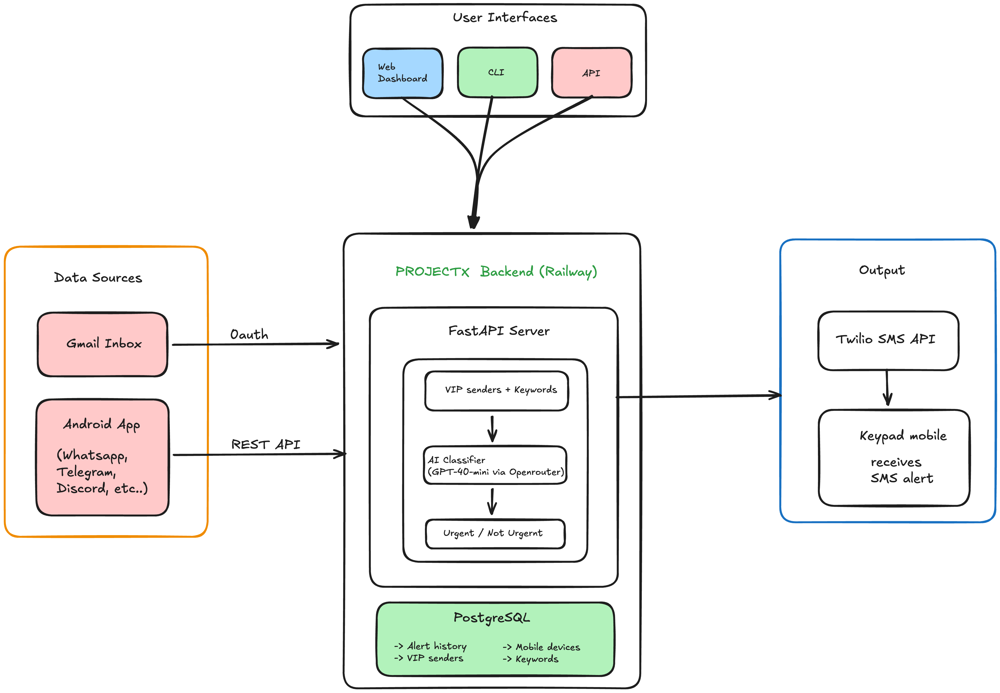
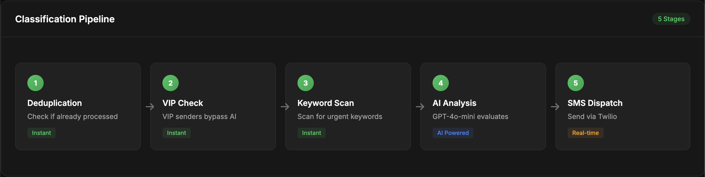
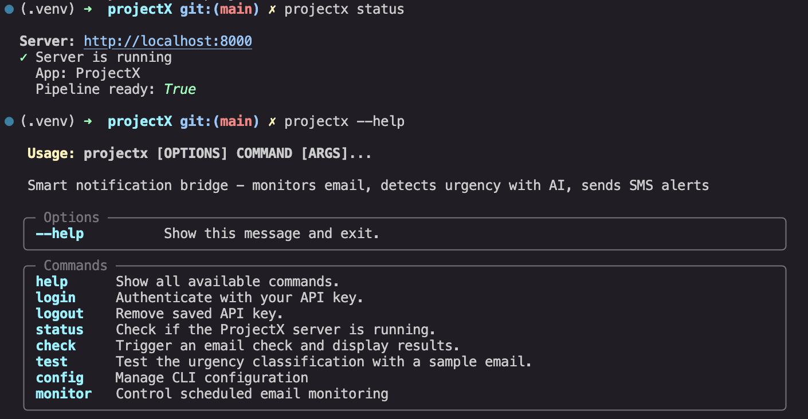
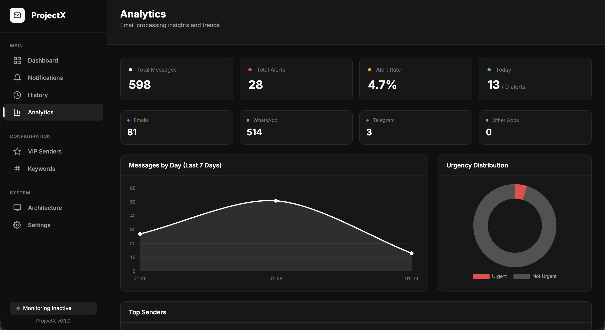

<div align="center">

# ProjectX

### *Remove distractions, not smartphones.*

**AI-powered notification bridge that forwards urgent messages to your keypad phone via SMS.**

[](https://projectx-solai.up.railway.app)
[](https://pypi.org/project/projectx-cli/)
[](https://python.org)

</div>

---

## Why I Built This

I know this is subjective — smartphones are incredibly helpful. But they come with huge distractions.

I'm a final-year student currently doing my internship. When I go to the office, I'd love to carry just a keypad phone. But the problem? I might miss emails from college, important messages from parents, or updates from Discord.

So I built ProjectX.

The name isn't fancy because this isn't a consumer product — I built it for my personal use. I just picked a random name and started solving my problem.

**The core idea isn't to remove smartphones from my life. I just wanted to remove distractions.**

Most keypad phones support SMS and calls. I thought — why not use this as a bridge? So I built a backend with AI agents that monitor email, plus an Android app that captures notifications from any messaging app. The system predicts priority based on your custom rules, and if something is urgent, it sends an SMS to your keypad phone.

I feel happy carrying a compact device in my pocket when I go out. You can keep your smartphone in your bag or at home — it's up to you.

---

## System Architecture

<div align="center">

</div>

---

## The Classification Pipeline

Messages go through a 3-stage intelligent filter:

<div align="center">

</div>

| Stage | Speed | What It Checks |
|:-----:|:-----:|:---------------|
| **1. VIP** | Instant | Is sender in your VIP list? |
| **2. Keywords** | Instant | Contains "urgent", "deadline", etc.? |
| **3. AI** | ~2 sec | GPT-4o analyzes context and tone |

If Stage 1 or 2 matches → **URGENT** (instant, no AI needed)  
Otherwise → AI decides based on content

---

## The Office Problem

Another issue I face: when I'm at the office, I use company resources for development. I can't log into personal email, and there are lots of restrictions.

**Solution?** I built a Python CLI and published it on PyPI:

<div align="center">

</div>

```bash
pip install projectx-cli
projectx status
projectx check
```

Now I can check status and modify config from any terminal. Plus there's a web dashboard that stays in sync.

---

## Analytics Dashboard

Track message sources, urgency trends, and classification history — all in one place.

<div align="center">

</div>

---

## The WhatsApp Problem (And How I Solved It)

WhatsApp doesn't have a personal messaging API. Neither does Instagram DMs. Most projects stop here.

I didn't.

Instead of fighting API restrictions, I built an **Android app that captures notifications** using `NotificationListenerService`. This means I can monitor *any* messaging app — WhatsApp, Telegram, Instagram, Slack, Discord — without API access and without ban risk.

---

## Quick Start

**Option 1: Use the CLI** (easiest)
```bash
pip install projectx-cli
projectx login
projectx status
```

**Option 2: Self-host**
```bash
git clone https://github.com/redwing-381/projectx
cd projectx
python -m venv .venv && source .venv/bin/activate
pip install -e ".[dev]"
cp .env.example .env  # Add your API keys
uvicorn src.main:app --reload
```

---

## Tech Stack

<div align="center">

| Layer | Technology |
|:-----:|:----------:|
| **AI** | GPT-4o-mini via OpenRouter |
| **Backend** | FastAPI + PostgreSQL |
| **Mobile** | Native Android (Kotlin) |
| **CLI** | Typer + Rich |
| **SMS** | Twilio |
| **Deploy** | Railway |

</div>

---

## Four Ways to Access

<div align="center">

| Interface | Use Case |
|:---------:|:---------|
| 🌐 **Web** | Dashboard, analytics, configure VIP senders & keywords |
| 💻 **CLI** | Quick checks from office terminal |
| 📱 **Mobile** | Capture notifications from any app |
| 🔌 **API** | Programmatic access with authentication |

</div>

---

## What's Next

After this hackathon, I'm thinking of extending capabilities:
- Use the **calling function** on keypad phones to control the system
- **Reply to messages** via voice commands
- Build it into a full **personal assistant agent**

---

## Built With Kiro

This project was built using Kiro's spec-driven development:

- 8 feature specs (requirements → design → tasks)
- 17 property-based tests with Hypothesis
- Steering documents kept 8,000+ lines consistent

---

## Links

<div align="center">

| Resource | URL |
|:--------:|:----|
| 🌐 Live Demo | https://projectx-solai.up.railway.app |
| 📦 CLI Package | https://pypi.org/project/projectx-cli/ |
| 📝 Dev Log | [DEVLOG.md](DEVLOG.md) |

</div>

---

<div align="center">

**Built for the Dynamous + Kiro Hackathon 2026**

*Stay focused. Stay reachable.*

---

Thanks for reading! Feel free to check out the links and share your thoughts.

</div>
